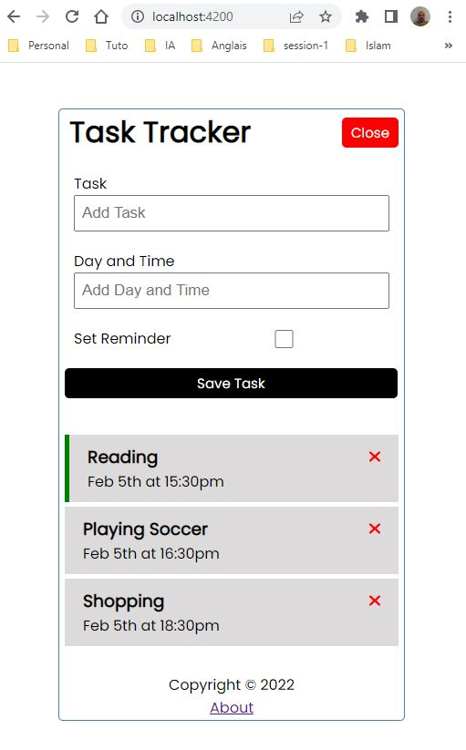

# TaskTrackerAngular

This project was generated with [Angular CLI](https://github.com/angular/angular-cli) version 14.2.7.

## Available Scripts

`npm i json-server` to install json-server 

`npm run server` to start the mock server. 

Open [http://localhost:3004/tasks](http://localhost:3004/tasks) to get all tasks.

`npm start` to start the application in the development mode. 
Navigate to [http://localhost:4200](http://localhost:4200)

## Test Application

The UI of the Task Tracker :

## Further help

To get more help on the Angular CLI use `ng help` or go check out the [Angular CLI Overview and Command Reference](https://angular.io/cli) page.
